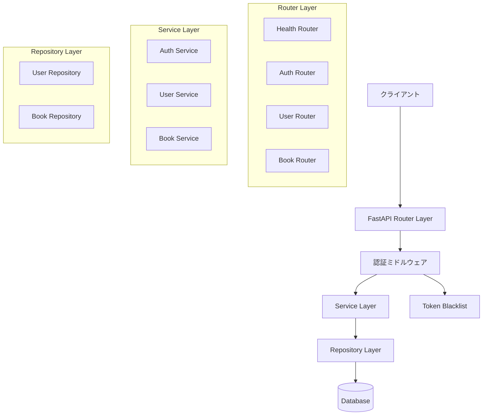
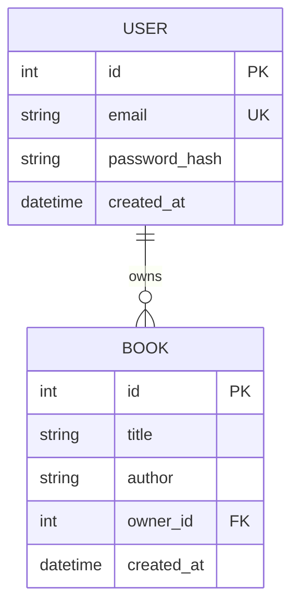

# Design Document: 家庭用蔵書管理REST API

## Overview

本システムは、家庭内の蔵書を管理するためのREST APIサーバーである。FastAPI（Python）で構築し、JWT認証によるセキュアなアクセス制御を実現する。ユーザーは自身のアカウントを作成・管理し、所有する書籍をCRUD操作で管理できる。

### 技術スタック

- **フレームワーク**: FastAPI (Python 3.11+)
- **データベース**: SQLite（開発用）/ PostgreSQL（本番用）、SQLAlchemy ORM
- **認証**: JWT (PyJWT) + bcrypt パスワードハッシュ
- **バリデーション**: Pydantic v2
- **テスト**: pytest + Hypothesis（プロパティベーステスト）

### 設計方針

- RESTful設計原則に従う
- レイヤードアーキテクチャ（Router → Service → Repository）
- 認証済みユーザーは自身のリソースのみ操作可能（リソースオーナーシップ）
- トークンブラックリストによるログアウト実現
- ユーザー登録を含む保護エンドポイントには認証が必要

## Architecture



### レイヤー構成

1. **Router Layer**: HTTPリクエスト/レスポンスの処理、入力バリデーション（Pydantic）
2. **Service Layer**: ビジネスロジック、認可チェック、エラーハンドリング
3. **Repository Layer**: データベースアクセス、クエリ実行
4. **Auth Middleware**: JWTトークン検証、ブラックリストチェック

### ディレクトリ構成

```
src/
├── app/
│   ├── main.py              # FastAPIアプリケーション初期化
│   ├── config.py            # 環境変数・設定管理
│   ├── database.py          # DB接続・セッション管理
│   ├── models/
│   │   ├── __init__.py
│   │   ├── user.py          # User SQLAlchemy model
│   │   └── book.py          # Book SQLAlchemy model
│   ├── schemas/
│   │   ├── __init__.py
│   │   ├── user.py          # User Pydantic schemas
│   │   ├── book.py          # Book Pydantic schemas
│   │   └── auth.py          # Auth Pydantic schemas
│   ├── routers/
│   │   ├── __init__.py
│   │   ├── health.py        # GET /health
│   │   ├── auth.py          # POST /auth/login, POST /auth/logout
│   │   ├── users.py         # POST /users, GET /users/{id}, DELETE /users/{id}
│   │   └── books.py         # POST /books, GET /books, GET /books/{id}, DELETE /books/{id}
│   ├── services/
│   │   ├── __init__.py
│   │   ├── auth_service.py  # 認証・トークン管理ロジック
│   │   ├── user_service.py  # ユーザー管理ロジック
│   │   └── book_service.py  # 書籍管理ロジック
│   ├── repositories/
│   │   ├── __init__.py
│   │   ├── user_repository.py
│   │   └── book_repository.py
│   ├── auth/
│   │   ├── __init__.py
│   │   ├── jwt_handler.py   # JWT生成・検証
│   │   ├── password.py      # bcryptハッシュ処理
│   │   ├── dependencies.py  # FastAPI認証依存関係
│   │   └── blacklist.py     # トークンブラックリスト管理
│   └── exceptions.py        # カスタム例外定義
└── tests/
    ├── conftest.py
    ├── factories.py
    ├── properties/
    │   ├── test_user_properties.py
    │   ├── test_book_properties.py
    │   └── test_auth_properties.py
    ├── unit/
    │   ├── test_jwt_handler.py
    │   ├── test_password.py
    │   └── test_validators.py
    └── integration/
        ├── test_health.py
        ├── test_user_endpoints.py
        ├── test_book_endpoints.py
        └── test_auth_endpoints.py
```

## Components and Interfaces

### API Endpoints

| メソッド | パス | 認証 | 説明 |
|---------|------|------|------|
| GET | /health | 不要 | ヘルスチェック |
| POST | /users | 必要 | ユーザー登録 |
| GET | /users/{user_id} | 必要 | ユーザー情報取得 |
| DELETE | /users/{user_id} | 必要 | ユーザー削除 |
| POST | /auth/login | 不要 | ログイン |
| POST | /auth/logout | 必要 | ログアウト |
| POST | /books | 必要 | 書籍登録 |
| GET | /books | 必要 | 書籍一覧取得 |
| GET | /books/{book_id} | 必要 | 書籍詳細取得 |
| DELETE | /books/{book_id} | 必要 | 書籍削除 |

### Auth Dependencies（認証依存関係）

```python
async def get_current_user(token: str = Depends(oauth2_scheme)) -> User:
    """
    JWTトークンを検証し、現在のユーザーを返す。
    - トークンがブラックリストに含まれる場合: 401
    - トークンが期限切れの場合: 401
    - トークンが不正な場合: 401
    """
    ...
```

### JWT Handler

```python
class JWTHandler:
    def create_access_token(self, user_id: int, email: str) -> str:
        """有効期限30分のアクセストークンを生成。ペイロードにuser_idとemailを含む"""
        ...
    
    def decode_token(self, token: str) -> dict:
        """トークンをデコードし、ペイロードを返す。無効な場合は例外を発生"""
        ...
```

### Token Blacklist

```python
class TokenBlacklist:
    def add(self, token: str, expires_at: datetime) -> None:
        """トークンをブラックリストに追加"""
        ...
    
    def is_blacklisted(self, token: str) -> bool:
        """トークンがブラックリストに含まれるか確認"""
        ...
```

### User Service

```python
class UserService:
    def create_user(self, email: str, password: str) -> UserResponse:
        """ユーザー作成。メールアドレス重複時は409エラー"""
        ...
    
    def get_user(self, user_id: int, requesting_user_id: int) -> UserResponse:
        """ユーザー取得。他ユーザーへのアクセスは403エラー"""
        ...
    
    def delete_user(self, user_id: int, requesting_user_id: int) -> None:
        """ユーザーおよび紐づく書籍をアトミックに削除"""
        ...
```

### Book Service

```python
class BookService:
    def create_book(self, title: str, author: str, owner_id: int) -> BookResponse:
        """書籍作成。重複タイトル・著者の組み合わせも許容"""
        ...
    
    def get_books(self, owner_id: int) -> list[BookResponse]:
        """ユーザーの全書籍を取得"""
        ...
    
    def get_book(self, book_id: int, owner_id: int) -> BookResponse:
        """特定書籍取得。他ユーザーの書籍は404エラー"""
        ...
    
    def delete_book(self, book_id: int, owner_id: int) -> None:
        """書籍削除。他ユーザーの書籍は404エラー"""
        ...
```

## Data Models

### User Model

```python
class User(Base):
    __tablename__ = "users"
    
    id: int          # Primary Key, auto-increment
    email: str       # Unique, 有効なメールアドレス形式, 最大254文字
    password_hash: str  # bcryptハッシュ化パスワード
    created_at: datetime  # レコード作成日時
```

### Book Model

```python
class Book(Base):
    __tablename__ = "books"
    
    id: int          # Primary Key, auto-increment
    title: str       # 1〜200文字
    author: str      # 1〜100文字
    owner_id: int    # Foreign Key → users.id (CASCADE DELETE)
    created_at: datetime  # レコード作成日時
```

### ER Diagram



### Pydantic Schemas

```python
# User schemas
class UserCreate(BaseModel):
    email: EmailStr = Field(max_length=254)
    password: str = Field(min_length=8, max_length=72)

class UserResponse(BaseModel):
    id: int
    email: str

# Book schemas
class BookCreate(BaseModel):
    title: str = Field(min_length=1, max_length=200)
    author: str = Field(min_length=1, max_length=100)

class BookResponse(BaseModel):
    id: int
    title: str
    author: str
    owner_id: int

# Auth schemas
class LoginRequest(BaseModel):
    email: EmailStr
    password: str

class TokenResponse(BaseModel):
    access_token: str
    token_type: str = "bearer"
```


## Correctness Properties

*A property is a characteristic or behavior that should hold true across all valid executions of a system—essentially, a formal statement about what the system should do. Properties serve as the bridge between human-readable specifications and machine-verifiable correctness guarantees.*

### Property 1: ユーザー登録ラウンドトリップ

*For any* valid email (有効なメールアドレス形式、最大254文字) and valid password (8〜72文字), creating a user and then retrieving that user by ID SHALL return a response containing the same email and an assigned user ID, with no password field exposed.

**Validates: Requirements 2.1, 3.1**

### Property 2: パスワードハッシュ化

*For any* valid password used in user registration, the value stored in the database SHALL be a valid bcrypt hash that does NOT equal the plaintext password, and verifying the hash against the original password SHALL succeed.

**Validates: Requirements 2.4**

### Property 3: 無効なユーザー入力の拒否

*For any* email that violates constraints (invalid email format, or exceeds 254 characters) OR any password that violates constraints (length < 8 or length > 72), the registration request SHALL be rejected with a 422 status code and the response SHALL indicate which validation rule was violated.

**Validates: Requirements 2.3**

### Property 4: メールアドレスの一意性

*For any* valid email address, if a user with that email already exists, a subsequent registration request with the same email SHALL be rejected with a 409 status code and the message "このメールアドレスは既に使用されています".

**Validates: Requirements 2.2**

### Property 5: ユーザーリソースのオーナーシップ

*For any* two distinct authenticated users A and B, user A's request to GET or DELETE user B's resource SHALL be rejected with a 403 status code.

**Validates: Requirements 3.3, 4.2**

### Property 6: ユーザー削除のカスケード

*For any* authenticated user who owns N books (N ≥ 0), deleting that user SHALL atomically remove the user record AND all N associated book records from the database, leaving zero books with that owner_id.

**Validates: Requirements 4.1**

### Property 7: 書籍登録ラウンドトリップ

*For any* valid title (1〜200文字) and valid author (1〜100文字) submitted by an authenticated user, creating a book and then retrieving it by ID SHALL return a response containing the same title, author, and the authenticated user's ID as owner_id.

**Validates: Requirements 5.1, 6.3**

### Property 8: 無効な書籍入力の拒否

*For any* book creation request where title is empty/missing/exceeds 200 characters OR author is empty/missing/exceeds 100 characters, the request SHALL be rejected with a 422 status code indicating which field violated which constraint.

**Validates: Requirements 5.2**

### Property 9: 書籍の重複許容

*For any* authenticated user and any valid title-author combination, registering the same title and author multiple times SHALL create distinct book records each with a unique book ID.

**Validates: Requirements 5.4**

### Property 10: 書籍リソースの隔離

*For any* two distinct authenticated users A and B, if user B owns a book, user A's request to GET or DELETE that book SHALL receive a 404 status code (not revealing the book's existence).

**Validates: Requirements 6.4, 7.2**

### Property 11: 書籍一覧の完全性

*For any* authenticated user who owns N books, a GET request to the book list endpoint SHALL return exactly N books, and the set of returned book IDs SHALL equal the set of book IDs created by that user.

**Validates: Requirements 6.1, 6.2**

### Property 12: ログインラウンドトリップ

*For any* registered user with known credentials, a login request with the correct email and password SHALL return a 200 response containing a valid JWT access token with token_type "bearer".

**Validates: Requirements 8.1**

### Property 13: ログイン失敗時の情報非開示

*For any* login attempt with an incorrect email OR incorrect password, the response SHALL be a 401 status code with the error message "認証に失敗しました" that does NOT reveal which field (email or password) was incorrect.

**Validates: Requirements 8.2**

### Property 14: トークン有効期限

*For any* successful login, the issued JWT access token's `exp` claim SHALL be set to exactly 30 minutes after the `iat` claim.

**Validates: Requirements 8.4, 10.5**

### Property 15: ログアウトによるトークン無効化

*For any* authenticated user who performs a logout, subsequent requests to any protected endpoint using the same access token SHALL be rejected with a 401 status code.

**Validates: Requirements 9.1, 9.2**

### Property 16: 不正トークンの拒否

*For any* request to a protected endpoint carrying a token that is expired, tampered, malformed, or missing, the API SHALL respond with a 401 status code.

**Validates: Requirements 10.1, 10.2, 10.4**

## Error Handling

### エラーレスポンス形式

すべてのエラーレスポンスは統一されたJSON形式で返す:

```json
{
  "detail": "エラーメッセージ"
}
```

バリデーションエラー（422）の場合はFastAPI標準形式:

```json
{
  "detail": [
    {
      "loc": ["body", "field_name"],
      "msg": "エラー内容",
      "type": "エラータイプ"
    }
  ]
}
```

### エラーコード一覧

| ステータスコード | 状況 | メッセージ例 |
|----------------|------|-------------|
| 401 Unauthorized | トークン未提供/無効/期限切れ | "認証が必要です" / "トークンが無効です" / "トークンの有効期限が切れています" |
| 401 Unauthorized | ログイン失敗 | "認証に失敗しました" |
| 403 Forbidden | 他ユーザーのリソースへのアクセス | "このリソースへのアクセス権限がありません" |
| 404 Not Found | リソースが存在しない | "ユーザーが見つかりません" / "書籍が見つかりません" |
| 409 Conflict | メールアドレス重複 | "このメールアドレスは既に使用されています" |
| 422 Unprocessable Entity | バリデーションエラー | フィールド固有のバリデーション詳細 |

### 例外クラス設計

```python
class AppException(Exception):
    """アプリケーション基底例外"""
    status_code: int
    detail: str

class UnauthorizedException(AppException):
    status_code = 401

class ForbiddenException(AppException):
    status_code = 403

class NotFoundException(AppException):
    status_code = 404

class ConflictException(AppException):
    status_code = 409
```

### セキュリティ考慮事項

- **認証エラー**: メールアドレス/パスワードのどちらが不正かを明かさない（タイミング攻撃対策も考慮）
- **リソースアクセス**: 他ユーザーの書籍は404を返し、存在自体を隠蔽する
- **パスワード**: 平文を一切レスポンスに含めない
- **トークン**: ブラックリスト方式でログアウト後のトークン使用を防止

## Testing Strategy

### テストフレームワーク

- **pytest**: テストランナー
- **Hypothesis**: プロパティベーステスト
- **httpx + pytest-asyncio**: 非同期APIテスト（FastAPI TestClient）
- **factory_boy**: テストデータ生成

### テスト構成

```
tests/
├── conftest.py              # 共通フィクスチャ（TestClient, DB session）
├── factories.py             # テストデータファクトリ
├── properties/
│   ├── test_user_properties.py      # Property 1-6
│   ├── test_book_properties.py      # Property 7-11
│   └── test_auth_properties.py      # Property 12-16
├── unit/
│   ├── test_jwt_handler.py
│   ├── test_password.py
│   └── test_validators.py
└── integration/
    ├── test_health.py
    ├── test_user_endpoints.py
    ├── test_book_endpoints.py
    └── test_auth_endpoints.py
```

### プロパティベーステスト

- **ライブラリ**: Hypothesis (Python)
- **反復回数**: 最小100回（`@settings(max_examples=100)`）
- **各テストにタグ付け**: コメントでデザインドキュメントのプロパティ番号を参照

```python
# Example: Property 1 test structure
@given(
    email=st.emails().filter(lambda e: len(e) <= 254),
    password=st.text(min_size=8, max_size=72, alphabet=st.characters(blacklist_categories=('Cs',)))
)
@settings(max_examples=100)
def test_user_registration_round_trip(email, password):
    """Feature: home-book-management-api, Property 1: ユーザー登録ラウンドトリップ"""
    # Create user → Retrieve user → Verify email preserved, no password exposed
    ...
```

### ユニットテスト

- バリデーションロジックの境界値テスト
- JWT生成・検証の正常系/異常系
- bcryptハッシュの正常系

### 統合テスト

- 各エンドポイントのE2Eフロー
- ヘルスチェックの応答確認
- 認証フロー全体（登録→ログイン→操作→ログアウト）

### テスト環境

- インメモリSQLite（テスト用データベース）
- 各テストケースごとにDBをリセット（フィクスチャでトランザクションロールバック）
- 環境変数でJWTシークレットキーをテスト用値に固定
