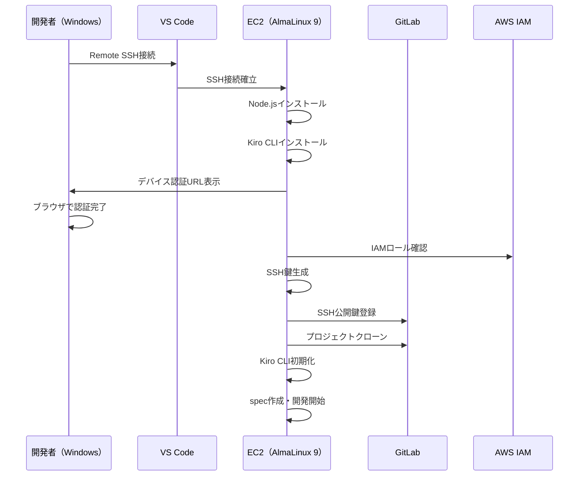

# Design Document

## Overview

本設計では、AWS EC2インスタンス（AlmaLinux 9）上にKiro CLI開発環境を構築するためのガイドドキュメントの構造・内容・構成を定義する。ガイドはマークダウン形式で作成し、WindowsクライアントからVS Code Remote SSH接続した状態で参照・実行可能な手順書とする。

ガイドドキュメントは以下の特徴を持つ：
- 段階的に実行可能なステップバイステップ形式
- 各ステップにバリデーション（確認コマンド）を含む
- トラブルシューティングセクションで一般的な問題に対応
- GitLabとの統合ワークフローを含む完全な開発フロー

## Architecture

### ドキュメント構成

ガイドドキュメントは単一のマークダウンファイルとして構成し、論理的なセクションに分割する。

```mermaid
graph TD
    A[ガイドドキュメント] --> B[1. 前提条件]
    A --> C[2. Node.js環境構築]
    A --> D[3. Kiro CLIインストール]
    A --> E[4. 認証・初期設定]
    A --> F[5. IAMロール設定]
    A --> G[6. GitLab連携設定]
    A --> H[7. 開発ワークフロー]
    A --> I[8. トラブルシューティング]
    
    B --> B1[インスタンスタイプ]
    B --> B2[OS要件]
    B --> B3[ネットワーク要件]
    
    C --> C1[dnf経由インストール]
    C --> C2[nvm経由インストール]
    C --> C3[バージョン確認]
    
    D --> D1[npmインストール]
    D --> D2[依存パッケージ]
    D --> D3[パーミッション対応]
    
    E --> E1[デバイス認証フロー]
    E --> E2[認証確認]
    
    F --> F1[必要権限]
    F --> F2[ロールアタッチ]
    F --> F3[代替認証]
    
    G --> G1[Git/SSH設定]
    G --> G2[GitLabクローン]
    G --> G3[Kiro初期化]
    
    H --> H1[spec作成]
    H --> H2[コード実装]
    H --> H3[Git操作/MR]
```



### 実行フロー

ユーザーはガイドドキュメントに従い、以下の順序で環境を構築する：



## Components and Interfaces

### ドキュメントコンポーネント

| コンポーネント | 説明 | 対応要件 |
|---|---|---|
| 前提条件セクション | インスタンススペック、OS、ネットワーク要件 | Requirement 1 |
| Node.jsセクション | インストール手順、バージョン管理 | Requirement 2 |
| Kiro CLIセクション | インストール、依存パッケージ | Requirement 3 |
| 認証セクション | デバイス認証フロー、アカウント設定 | Requirement 4 |
| IAMセクション | ロール設定、権限ポリシー | Requirement 5 |
| 開発ワークフローセクション | 基本操作、コマンド一覧 | Requirement 6 |
| トラブルシューティングセクション | 問題と解決策 | Requirement 7 |
| GitLabクローンセクション | Git/SSH設定、クローン手順 | Requirement 8 |
| GitLab+Kiro統合セクション | 統合開発ワークフロー | Requirement 9 |

### セクション間の依存関係

各セクションは以下の依存関係を持ち、順序通りに実行する必要がある：

1. **前提条件** → 独立（最初に確認）
2. **Node.js** → 前提条件に依存
3. **Kiro CLI** → Node.jsに依存
4. **認証** → Kiro CLIに依存
5. **IAMロール** → EC2インスタンス自体に依存（Kiro CLIとは並行可能）
6. **GitLabクローン** → Git Client、SSH鍵に依存（Kiro CLIとは独立）
7. **開発ワークフロー** → Kiro CLI + 認証 + GitLabクローンに依存
8. **トラブルシューティング** → 独立（リファレンスとして使用）

### ドキュメント内の各手順のインターフェース

各手順ステップは以下の構造を持つ：

```
## ステップタイトル

### 概要
- 目的の説明
- 前提条件の確認

### 手順
1. コマンドまたは操作
2. 期待される出力
3. バリデーション方法

### トラブルシューティング（該当する場合）
- 問題の症状
- 原因
- 解決方法
```

## Data Models

### ガイドドキュメントのメタデータ構造

ドキュメント全体は以下の論理構造を持つ：

```yaml
guide:
  title: "Kiro CLI EC2セットアップガイド"
  target_os: "AlmaLinux 9"
  target_platform: "AWS EC2"
  client: "Windows + VS Code Remote SSH"
  
  prerequisites:
    instance_type: "t3.medium以上推奨"
    os: "AlmaLinux 9"
    disk: "20GB以上"
    network: "インターネットアクセス必須"
    
  sections:
    - id: "node-installation"
      depends_on: ["prerequisites"]
      methods: ["dnf", "nvm"]
      
    - id: "kiro-cli-installation"
      depends_on: ["node-installation"]
      
    - id: "authentication"
      depends_on: ["kiro-cli-installation"]
      auth_flow: "device-code"
      
    - id: "iam-role"
      depends_on: ["prerequisites"]
      
    - id: "gitlab-setup"
      depends_on: ["prerequisites"]
      sub_steps: ["git-install", "ssh-key-gen", "gitlab-register", "clone"]
      
    - id: "development-workflow"
      depends_on: ["authentication", "gitlab-setup"]
      
    - id: "troubleshooting"
      depends_on: []
```

### コマンドリファレンス構造

ガイド内で使用するコマンドは以下のカテゴリに整理する：

| カテゴリ | コマンド例 | 説明 |
|---|---|---|
| パッケージ管理 | `sudo dnf install` | AlmaLinux 9のパッケージインストール |
| Node.js管理 | `node --version`, `npm --version` | ランタイム確認 |
| Kiro CLI | `kiro --version`, `kiro init`, `kiro spec` | Kiro操作 |
| 認証 | `kiro login` | Kiro認証フロー |
| AWS | `aws sts get-caller-identity` | IAM確認 |
| Git | `git clone`, `git push` | バージョン管理 |
| SSH | `ssh-keygen`, `ssh -T` | SSH鍵管理・接続確認 |

## Correctness Properties

*A property is a characteristic or behavior that should hold true across all valid executions of a system — essentially, a formal statement about what the system should do. Properties serve as the bridge between human-readable specifications and machine-verifiable correctness guarantees.*

**PBT非適用の説明**

本フィーチャーはドキュメント（ガイド）の作成であり、実行可能なコードを生成するものではない。すべてのAcceptance Criteriaは「ガイドドキュメントに何が記載されるべきか」を定義しており、純粋関数やアルゴリズムのテストは存在しない。

PBTが適用できない理由：
- 入力/出力を持つ関数やアルゴリズムが存在しない
- ドキュメントの正しさは「内容の完全性」と「技術的正確性」で判断される
- 「任意の入力に対して普遍的に成り立つ性質」を定義できる対象がない

代わりに、以下のドキュメントレベルの正しさの性質を定義する：

### Property 1: 要件カバレッジの完全性

*For any* Requirementとそれに属するAcceptance Criteria、ガイドドキュメント内の対応セクションはそのすべてのAcceptance Criteriaを網羅する記載を含まなければならない。

**Validates: Requirements 1.1, 1.2, 1.3, 1.4, 2.1, 2.2, 2.3, 2.4, 3.1, 3.2, 3.3, 3.4, 4.1, 4.2, 4.3, 4.4, 5.1, 5.2, 5.3, 5.4, 6.1, 6.2, 6.3, 6.4, 7.1, 7.2, 7.3, 7.4**

### Property 2: 手順の依存関係の正確性

*For any* ガイド内のステップ、その前提条件として記載された依存関係は実際のインストール・設定の技術的依存関係と一致しなければならない。

**Validates: Requirements 2.2, 3.1, 4.3, 6.4**

### Property 3: バリデーションコマンドの対応性

*For any* インストール・設定ステップ、そのステップの成功を確認できるバリデーションコマンドが対応して記載されなければならない。

**Validates: Requirements 2.3, 3.2, 4.1**

### Property 4: エラーケースのカバレッジ

*For any* ガイドに記載されたコマンド操作、一般的なエラーケースとその対処法がトラブルシューティングセクションまたは該当セクション内に含まれなければならない。

**Validates: Requirements 3.3, 4.4, 5.4, 7.1, 7.2, 7.3, 7.4**

## Error Handling

### ガイドに含めるエラーハンドリング方針

ガイドドキュメントでは、各セクションで発生しうるエラーと対処法を以下の方針で記載する：

#### 1. Node.js関連エラー

| エラー | 原因 | 対処法 |
|---|---|---|
| `command not found: node` | パスが通っていない | `source ~/.bashrc` またはPATH設定確認 |
| バージョン不整合 | 古いNode.jsバージョン | nvmで適切なバージョンに切り替え |
| dnfでパッケージが見つからない | リポジトリ未追加 | NodeSourceリポジトリ追加手順を実行 |

#### 2. Kiro CLI関連エラー

| エラー | 原因 | 対処法 |
|---|---|---|
| `EACCES` パーミッションエラー | npmグローバルインストール権限不足 | npm prefixの変更、またはnvm使用 |
| 認証失敗 | トークン期限切れ/ネットワーク | `kiro login` 再実行、ネットワーク確認 |
| デバイス認証タイムアウト | 認証コード有効期限切れ | 再度`kiro login`を実行 |

#### 3. IAM/AWS関連エラー

| エラー | 原因 | 対処法 |
|---|---|---|
| `Unable to locate credentials` | IAMロール未設定 | ロールアタッチまたはアクセスキー設定 |
| `AccessDenied` | 権限不足 | IAMポリシーの確認・追加 |

#### 4. GitLab/SSH関連エラー

| エラー | 原因 | 対処法 |
|---|---|---|
| `Permission denied (publickey)` | SSH鍵未登録/不一致 | SSH鍵の再生成・再登録 |
| `Host key verification failed` | known_hosts未登録 | `ssh-keyscan`でホスト鍵追加 |
| クローン失敗 | URL誤り/権限不足 | SSH URL確認、プロジェクトアクセス権確認 |

#### 5. AlmaLinux 9固有エラー

| エラー | 原因 | 対処法 |
|---|---|---|
| SELinuxによるブロック | SELinuxポリシー | `audit2allow`でポリシー追加、または一時的にpermissiveモード |
| ファイアウォールブロック | firewalld設定 | 必要なポートのオープン |
| dnfリポジトリエラー | リポジトリ設定不正 | `dnf clean all`、リポジトリ設定確認 |

### エラーハンドリングの記載パターン

各エラーは以下のフォーマットで記載する：

```markdown
#### 問題: [エラーの症状]

**原因:** [根本原因の説明]

**解決方法:**
1. [ステップ1]
2. [ステップ2]

**確認コマンド:**
```bash
[確認用コマンド]
```
```

## Testing Strategy

### PBT非適用の理由

本フィーチャーはドキュメント（ガイド）の作成であり、実行可能なコードを生成するものではない。すべてのAcceptance Criteriaは「ガイドドキュメントに何が記載されるべきか」を定義しており、純粋関数やアルゴリズムのテストは存在しない。そのため、Property-Based Testingは適用しない。

### テスト戦略

本フィーチャーのテストは以下のアプローチで行う：

#### 1. ドキュメントレビュー（手動）

- 各セクションがAcceptance Criteriaを満たしているかのチェックリストレビュー
- 技術的正確性の確認（コマンドの正当性、バージョン情報の正確性）
- ドキュメント内のリンク・参照の整合性確認

#### 2. 手順の実行テスト（手動）

- 実際のEC2インスタンス（AlmaLinux 9）で手順を最初から最後まで実行
- 各ステップのバリデーションコマンドが期待通りの出力を返すことを確認
- エラーケースの再現と、トラブルシューティング手順の有効性を確認

#### 3. コンテンツの完全性チェック

| 確認項目 | 検証方法 |
|---|---|
| 全Requirementのカバレッジ | 各Acceptance CriteriaがSHALLステートメントとして記載されていること |
| コマンドの実行可能性 | AlmaLinux 9環境で全コマンドが実行できること |
| 依存関係の正確性 | セクション間の前提条件が正しく記載されていること |
| バージョン情報の鮮度 | Node.js、Kiro CLIのバージョンが最新であること |

#### 4. ユーザビリティテスト

- ガイドに従って初めて環境構築する開発者が、追加のサポートなしで完了できるか
- 各ステップの説明が十分に明確か
- トラブルシューティングセクションが実際の問題解決に役立つか
